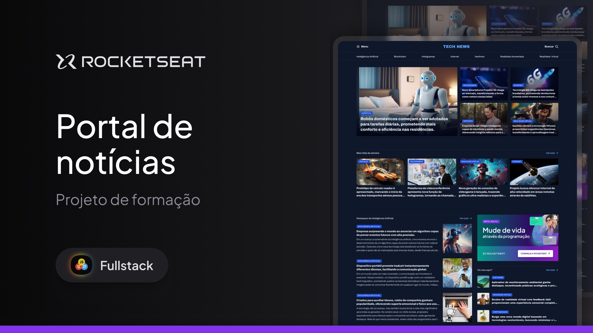

<h1 align="center">Portal de notícias</h1>

 

 

## Tecnologias

Esse projeto foi desenvolvido com as seguintes tecnologias:

- HTML e CSS
- Git e GitHub

## Projeto

O Portal de notícias é uma UI de uma página de notícias.

---

 
Desenvolvido por Luciano Hirano
